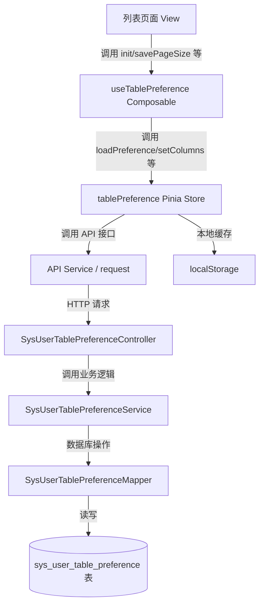
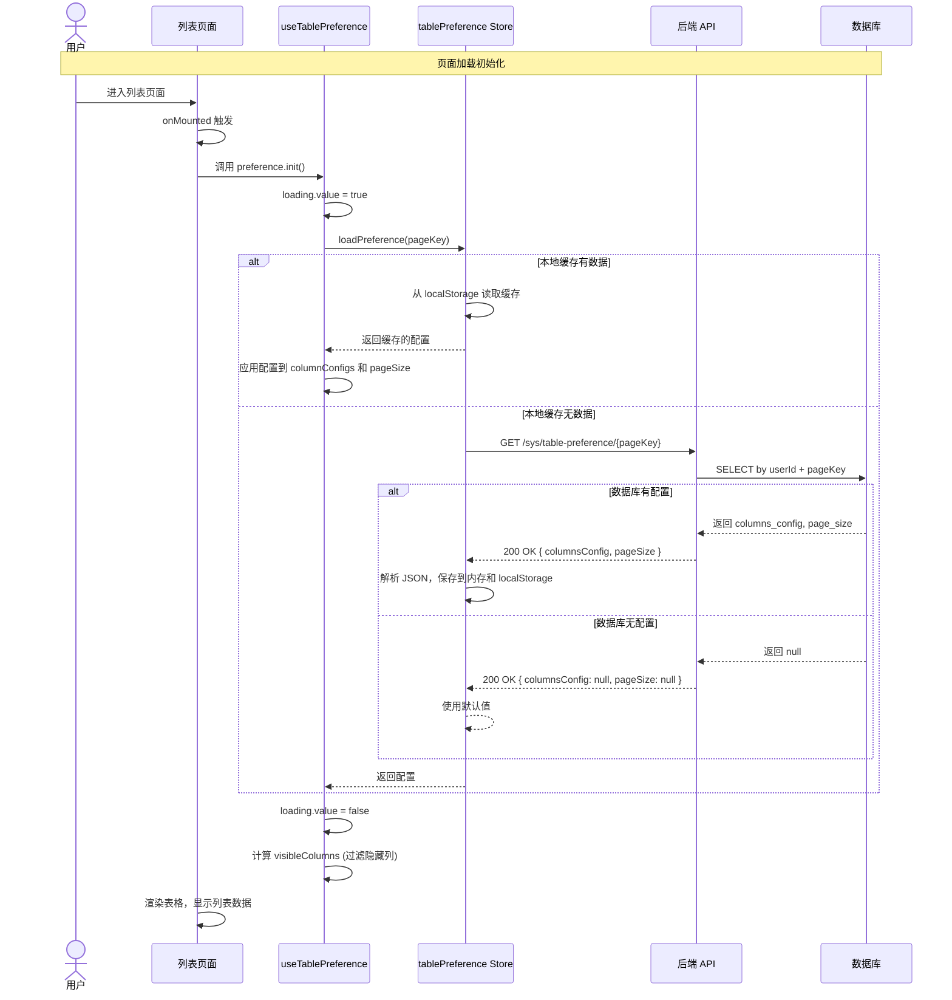
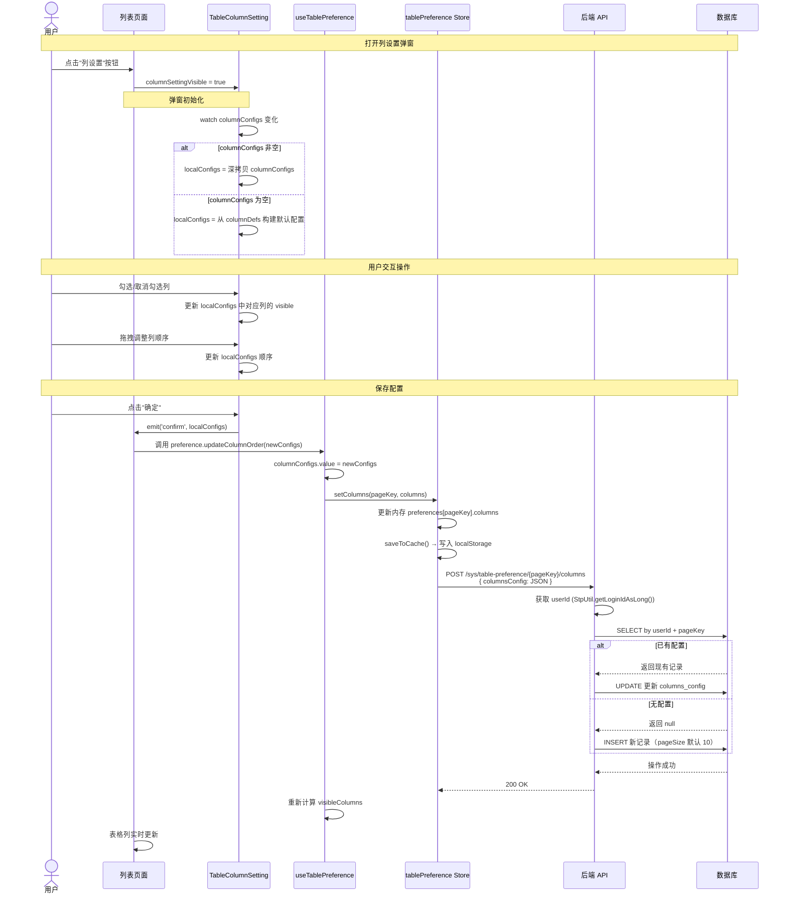
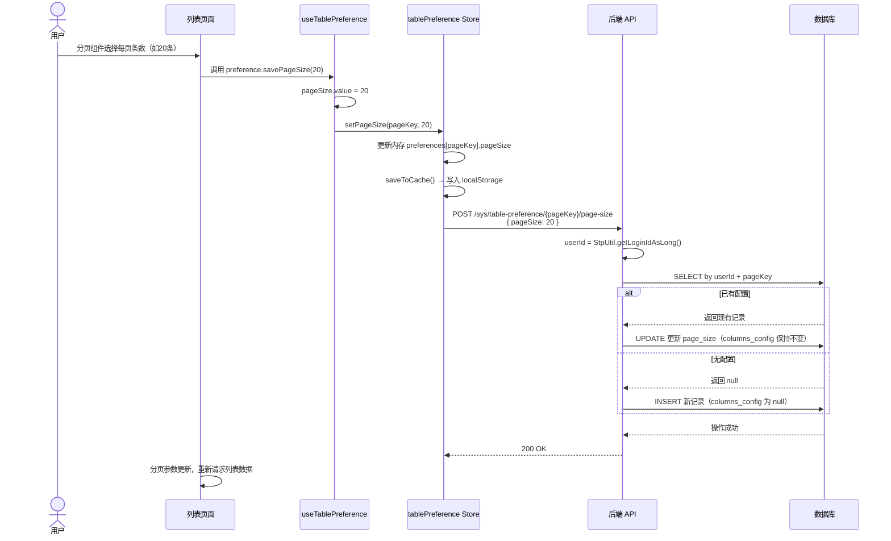
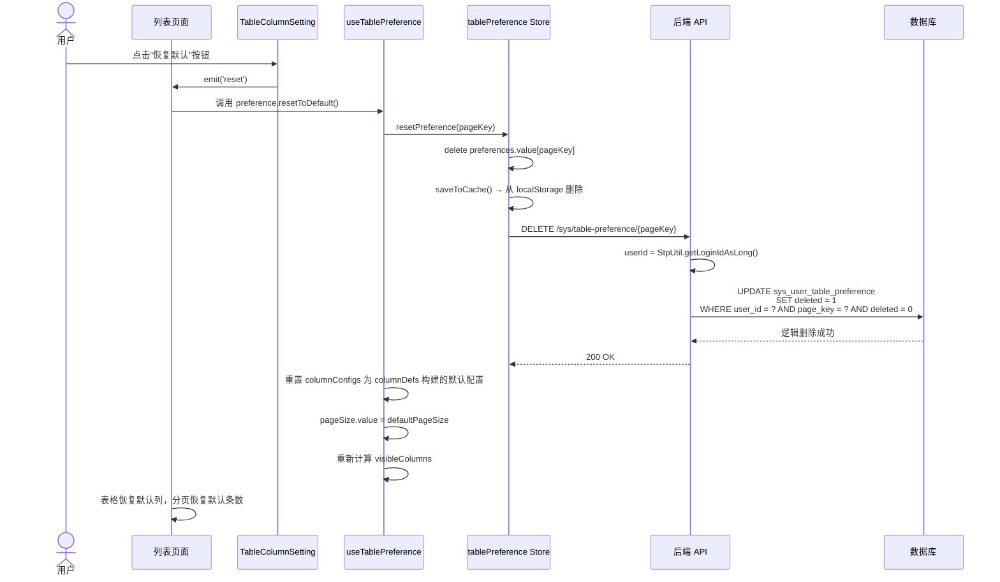

# 列设置功能前后端逻辑分析

## 1. 架构总览



---

## 2. 核心时序图

### 2.1 页面初始化加载偏好设置



### 2.2 用户打开列设置弹窗并保存



### 2.3 修改每页显示条数



### 2.4 恢复默认设置



---

## 3. 核心流程图

### 3.1 偏好设置加载流程

```mermaid
flowchart TD
    Start([开始：页面加载]) --> CallInit[调用 preference.init()]
    CallInit --> SetLoading[设置 loading = true]
    SetLoading --> CallStore[调用 store.loadPreference(pageKey)]
    
    CallStore --> CheckCache{本地缓存是否有数据?}
    
    CheckCache -->|有| UseCache[使用缓存配置]
    UseCache --> SkipAPI[跳过 API 请求]
    
    CheckCache -->|无| CheckLoading{是否正在加载?}
    CheckLoading -->|是| ReturnExisting[返回已有结果]
    CheckLoading -->|否| SetLoadingFlag[设置 loadingPages 防重]
    
    SetLoadingFlag --> CallAPI[调用 GET /sys/table-preference/{pageKey}]
    
    CallAPI --> APISuccess{API 调用成功?}
    APISuccess -->|是| ParseConfig[解析 columnsConfig JSON]
    ParseConfig --> CheckNull{返回的配置非空?}
    
    CheckNull -->|是| UseReturned[使用返回的 columns 和 pageSize]
    CheckNull -->|否| UseDefault[使用默认配置（pageSize=10）]
    
    APISuccess -->|否| LogError[记录错误日志]
    LogError --> CheckMem{内存中是否有数据?}
    CheckMem -->|有| UseMem[使用内存数据]
    CheckMem -->|无| ReturnNull[返回 null]
    
    UseReturned --> SaveStore[保存到内存 preferences[pageKey]]
    UseDefault --> SaveStore
    UseMem --> SkipSave
    
    SaveStore --> SaveCache[保存到 localStorage]
    SaveCache --> ClearLoading[清除 loadingPages 标记]
    SkipAPI --> ClearLoading
    ReturnExisting --> ClearLoading
    ReturnNull --> ClearLoading
    SkipSave --> ClearLoading
    
    ClearLoading --> SetLoadingFalse[设置 loading = false]
    SetLoadingFalse --> CalcColumns[计算 visibleColumns<br/>- 过滤 visible=false 的列<br/>- 固定列保持位置]
    
    CalcColumns --> Render[表格列渲染]
    Render --> End([结束])
```

### 3.2 列配置保存流程（updateColumnOrder）

```mermaid
flowchart TD
    Start([用户点击确定保存]) --> EmitConfirm[弹窗 emit confirm 事件]
    EmitConfirm --> UpdateConfigs[columnConfigs.value = newOrder]
    UpdateConfigs --> CallSave[调用 saveColumnConfigs()]
    CallSave --> CallStore[调用 store.setColumns(pageKey, columns)]
    
    CallStore --> CheckExist{preferences[pageKey] 是否存在?}
    
    CheckExist -->|否| CreateNew[创建新配置<br/>columns = 传入值, pageSize = 10]
    CreateNew --> SaveMem[保存到内存 preferences[pageKey]]
    
    CheckExist -->|是| UpdateColumns[仅更新 columns 字段<br/>pageSize 保持不变]
    UpdateColumns --> SaveMem
    
    SaveMem --> SaveCache[写入 localStorage 缓存]
    SaveCache --> CallAPI[调用 POST /sys/table-preference/{pageKey}/columns]
    
    CallAPI --> APICall{API 调用成功?}
    APICall -->|否| LogError[记录错误日志<br/>本地缓存仍然有效]
    APICall -->|是| BackendProcess[后端处理]
    
    BackendProcess --> GetUserId[获取当前登录 userId]
    GetUserId --> CheckDB{数据库中是否有该 userId + pageKey 记录?}
    
    CheckDB -->|有| UpdateDB[UPDATE columns_config<br/>page_size 保持不变]
    CheckDB -->|否| InsertDB[INSERT 新记录<br/>page_size = 10（默认）]
    
    UpdateDB --> DBDone[数据库操作完成]
    InsertDB --> DBDone
    LogError --> DBDone
    
    DBDone --> Recalc[重新计算 visibleColumns]
    Recalc --> Refresh[表格列实时刷新]
    Refresh --> End([结束])
```

### 3.3 重置偏好设置流程

```mermaid
flowchart TD
    Start([点击恢复默认]) --> EmitReset[弹窗 emit reset 事件]
    EmitReset --> CallReset[调用 preference.resetToDefault()]
    CallReset --> CallStore[调用 store.resetPreference(pageKey)]
    
    CallStore --> DeleteMem[delete preferences.value[pageKey]]
    DeleteMem --> UpdateCache[更新 localStorage<br/>移除该 pageKey]
    
    UpdateCache --> CallAPI[调用 DELETE /sys/table-preference/{pageKey}]
    CallAPI --> APICall{API 调用成功?}
    
    APICall -->|否| LogError[记录错误日志<br/>本地已重置生效]
    APICall -->|是| BackendReset[后端逻辑删除]
    
    BackendReset --> GetUserId[获取当前登录 userId]
    GetUserId --> SoftDelete[UPDATE sys_user_table_preference<br/>SET deleted = 1<br/>WHERE user_id = ? AND page_key = ? AND deleted = 0]
    
    SoftDelete --> DBResetDone[数据库逻辑删除完成]
    LogError --> DBResetDone
    
    DBResetDone --> ResetLocal[重置本地 columnConfigs 为 columnDefs 默认配置]
    ResetLocal --> ResetPageSize[pageSize.value = defaultPageSize]
    ResetPageSize --> Recalc[重新计算 visibleColumns]
    
    Recalc --> Refresh[表格恢复默认列]
    Refresh --> End([结束])
```

### 3.4 后端 Service 层 Upsert 逻辑

```mermaid
flowchart TD
    Start([savePreference/saveColumnsConfig/savePageSize]) --> SelectDB[selectByUserAndPage(userId, pageKey)]
    SelectDB --> Exist{返回记录 != null?}
    
    Exist -->|是| UpdateExisting[更新现有记录]
    
    subgraph "根据调用方法不同，更新不同字段"
        direction LR
        UpdateExisting -->|savePreference| Upd1[更新 columns_config + page_size]
        UpdateExisting -->|saveColumnsConfig| Upd2[仅更新 columns_config<br/>page_size 保持不变]
        UpdateExisting -->|savePageSize| Upd3[仅更新 page_size<br/>columns_config 保持不变]
    end
    
    Upd1 --> UpdateDB[updateById(existing)]
    Upd2 --> UpdateDB
    Upd3 --> UpdateDB
    
    Exist -->|否| InsertNew[创建新记录]
    
    subgraph "根据调用方法不同，设置不同字段"
        direction LR
        InsertNew -->|savePreference| Ins1[设置 columns_config + page_size]
        InsertNew -->|saveColumnsConfig| Ins2[设置 columns_config<br/>page_size = 10 默认]
        InsertNew -->|savePageSize| Ins3[设置 page_size<br/>columns_config = null]
    end
    
    Ins1 --> InsertDB[insert(preference)]
    Ins2 --> InsertDB
    Ins3 --> InsertDB
    
    UpdateDB --> Done([操作完成])
    InsertDB --> Done
```

---

## 4. 数据流与数据结构

### 4.1 前端数据流转

```mermaid
graph LR
    A[columnDefs<br/>静态列定义] --> B[useTablePreference]
    B --> C[columnConfigs<br/>响应式列配置]
    C --> D[visibleColumns 计算属性]
    D --> E[n-data-table columns]
    
    F[后端 API 数据<br/>{columnsConfig: JSON, pageSize: int}] -->|init| C
    C -->|用户操作| G[localStorage 缓存]
    C -->|保存| F
    
    H[localConfigs<br/>弹窗内临时配置] <-->|双向| C
```

### 4.2 后端数据流转

```mermaid
graph LR
    A[前端请求<br/>columnsConfig: JSON字符串<br/>pageSize: int] --> B[Controller]
    B -->|userId + pageKey + 字段| C[Service]
    C -->|Upsert 逻辑| D[Mapper]
    D -->|读写| E[(sys_user_table_preference)]
    
    E --> F[columns_config TEXT<br/>存储 JSON 数组字符串]
    E --> G[page_size INT<br/>存储每页条数]
    E --> H[唯一索引 uk_user_page<br/>(user_id, page_key, deleted)]
```

### 4.3 列配置 JSON 结构

```json
[
  {
    "key": "selection",
    "visible": true,
    "width": 50
  },
  {
    "key": "id",
    "visible": true,
    "width": 80
  },
  {
    "key": "username",
    "visible": true,
    "width": 150
  },
  {
    "key": "email",
    "visible": false
  },
  {
    "key": "status",
    "visible": true
  },
  {
    "key": "actions",
    "visible": true,
    "width": 180
  }
]
```

---

## 5. 关键代码引用

| 模块 | 代码位置 | 核心功能 |
|------|---------|---------|
| 前端组合式函数 | [useTablePreference.ts](file:///e:/工作资料/aicode/ai-java-vue/01/mars-ui/src/composables/useTablePreference.ts) | 封装表格偏好逻辑，提供 init/savePageSize/toggleColumn/moveColumn 等方法 |
| 前端状态管理 | [tablePreference.ts](file:///e:/工作资料/aicode/ai-java-vue/01/mars-ui/src/stores/tablePreference.ts) | Pinia Store，管理所有页面的偏好配置，支持 localStorage 缓存和后端同步 |
| 前端弹窗组件 | [TableColumnSetting.vue](file:///e:/工作资料/aicode/ai-java-vue/01/mars-ui/src/components/TableColumnSetting.vue) | 列设置弹窗，支持勾选、拖拽排序、全选/全不选/恢复默认 |
| 前端 API | [system.ts](file:///e:/工作资料/aicode/ai-java-vue/01/mars-ui/src/api/system.ts#L493-L545) | 表格偏好 API 接口定义 |
| 后端控制器 | [SysUserTablePreferenceController.java](file:///e:/工作资料/aicode/ai-java-vue/01/mars-api/mars-admin-api/src/main/java/com/mars/admin/controller/system/SysUserTablePreferenceController.java) | REST API 控制器，提供 6 个接口 |
| 后端服务 | [SysUserTablePreferenceServiceImpl.java](file:///e:/工作资料/aicode/ai-java-vue/01/mars-core/mars-system/src/main/java/com/mars/system/service/impl/SysUserTablePreferenceServiceImpl.java) | 业务逻辑实现，支持 Upsert 和逻辑删除 |
| 后端 Mapper | [SysUserTablePreferenceMapper.java](file:///e:/工作资料/aicode/ai-java-vue/01/mars-core/mars-system/src/main/java/com/mars/system/mapper/SysUserTablePreferenceMapper.java) | 数据访问层，包含自定义查询和逻辑删除 SQL |
| 后端实体 | [SysUserTablePreference.java](file:///e:/工作资料/aicode/ai-java-vue/01/mars-core/mars-system/src/main/java/com/mars/system/entity/SysUserTablePreference.java) | 数据库实体类 |
| 建表脚本 | [sys_user_table_preference.sql](file:///e:/工作资料/aicode/ai-java-vue/01/sql/sys_user_table_preference.sql) | 数据库建表 DDL |
| 自动建表 | [TableInitRunner.java](file:///e:/工作资料/aicode/ai-java-vue/01/mars-api/mars-admin-api/src/main/java/com/mars/admin/runner/TableInitRunner.java) | 应用启动时自动检查表并创建 |

---

## 6. 设计要点总结

1. **用户级隔离**：通过 `userId + pageKey + deleted` 唯一索引确保每个用户每个页面的配置独立存储
2. **Upsert 模式**：Service 层先查询再决定 Insert 或 Update，保证同一条记录反复更新
3. **双写缓存**：Pinia Store 同时写入内存和 localStorage，后端作为最终一致性存储
4. **乐观缓存**：API 失败不影响本地使用，本地配置始终优先
5. **防并发请求**：`loadingPages` Set 防止同一页面同时发起多个加载请求
6. **逻辑删除**：使用 `deleted = 1` 实现重置，保留历史数据便于审计
7. **固定列保护**：`fixed = left/right` 的列不可拖拽、不可取消勾选
8. **空数据兼容**：列配置为空时从 `columnDefs` 构建默认配置，避免 UI 空白
9. **JSON 存储**：列配置使用 TEXT 字段存储 JSON 字符串，灵活支持列的扩展属性（width 等）
10. **事务保护**：Service 层使用 `@Transactional` 确保数据一致性
